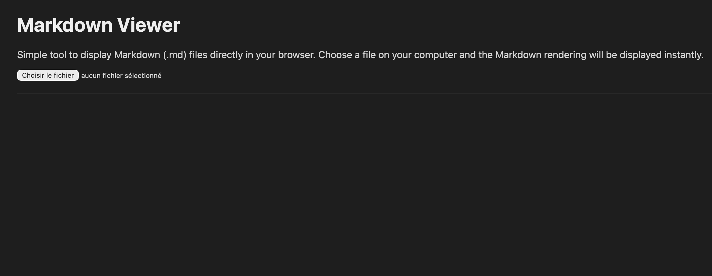
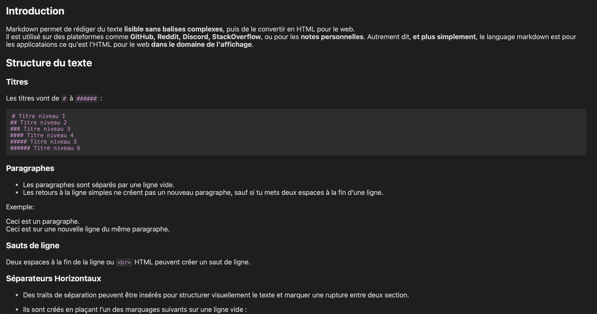
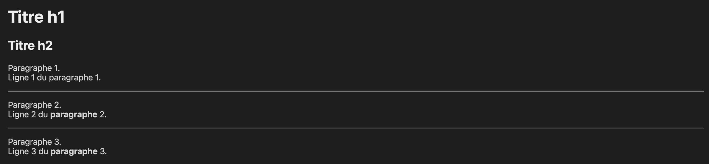

# <u>Markdown Viewer</u>
A simple **Markdown file viewer** that lets you open and display .md files directly in your browser. This tool is designed for beginners to practice HTML, CSS, and JavaScript while seeing Markdown rendered in a dark-mode interface similar to VS Code.

## <u>Features</u>
- Dark mode interface.
- Inline code and code blocks are properly styled
- Links, headings, lists, and other Markdown elements are supported
- Table of contents links (from the Markdown file) work automatically
- Easy to use: just select a `.md` file from your computer

## <u>How to use</u>
1. Clone or download this repository.
2. Place the Markdown-Viewer.html file in the same folder as the Markdown file you want to view.
3. Open [`Markdown-Viewer.html`](Markdown-Viewer.html) in your browser (Safari, Chrome, Firefox, etc.).
4. Click **Choose File** and select your Markdown file (`.md`).
5. The rendered Markdown will appear below the file input.

**Note**: It is important to make sure Markdown-Viewer.html is in the same folder as your Markdown file and any images it references, so it follows the correct relative paths and the images display correctly.

## <u>Screenshots</u>
### <u>Screenshot Markdown-Viewer once launched in Safari</u>:

  

### <u>Markdown-Viewer after selecting a file</u>:
#### <u>Golbal view</u>:

  

#### <u>Titles, Paragraphs & subsections</u>:

  

 

***Credit**: This are examples displaying the french wiki "Le Markdown pour les nuls" ([View on GitHub](https://github.com/TheBigBadImp/Le-Markdown-pour-les-nuls)).*